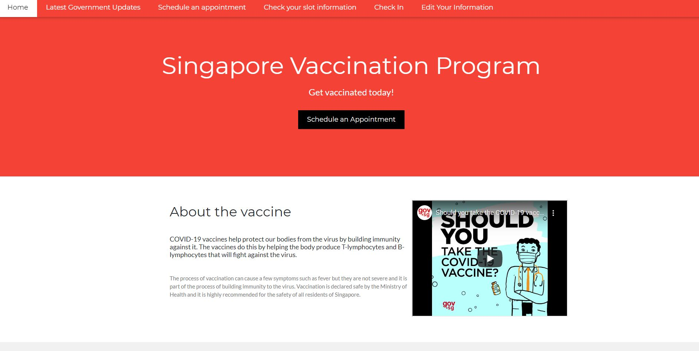
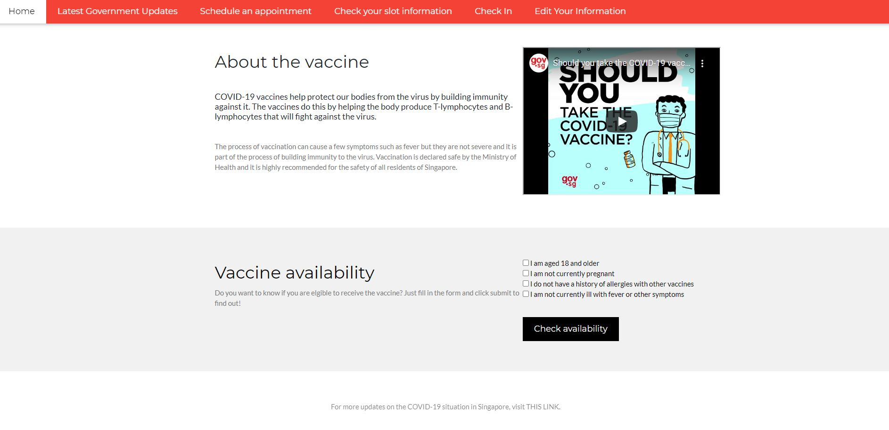
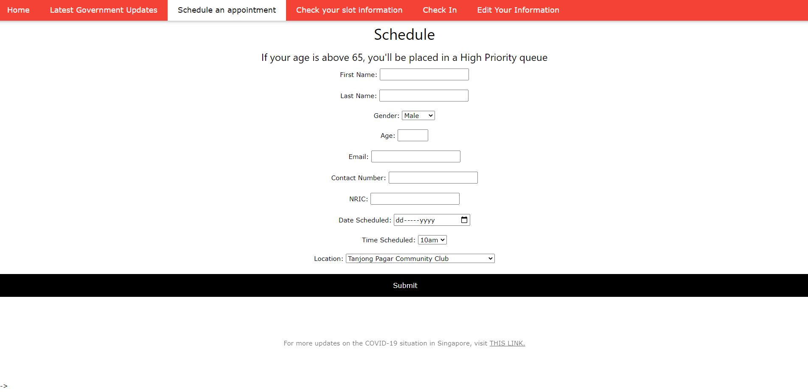
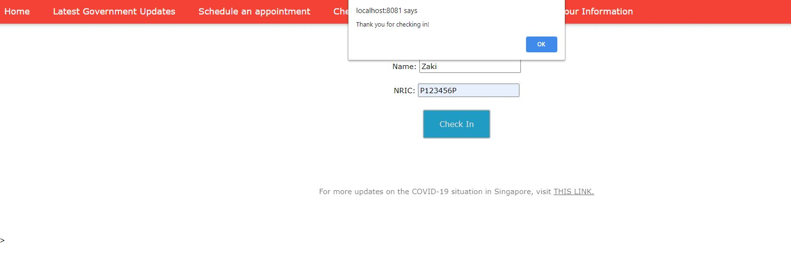
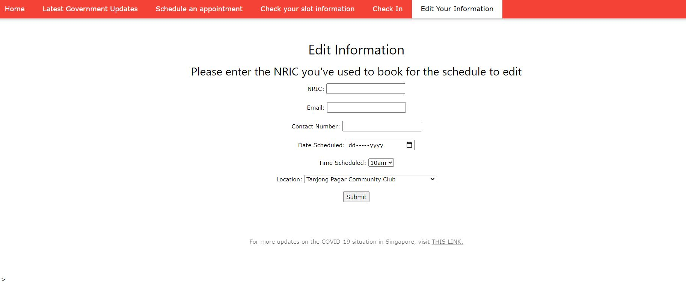

# Vaccine-Scheduling-Code-for-Hackathon-2021
# Problem Statement: 
# Vaccination Scheduling: Develop a mobile/web application through which patients and health organizations can manage scheduling and administration of the COVID-19 vaccines. The application can include features like vaccination eligibility, priority queue, smart overbooking, no-contact patient check-in, location-wise appointment, appointment reminders, etc.

In this project we used Java to code out our website for Vaccination Scheduling. For the database, we use Oracle SQL* Plus to store respective data from users. During scheduling an appointment, those users who are aged 65 and above will be given high priority so that they will be able to get vaccinated faster and earlier. Upon checking in using the 'Check In' page, users will have their status turn from 'Incomplete' to 'Complete'. This is to help clear up the database and make it more organised. For 'Edit Your Information' page, users will need to key in their NRIC which will then allow them to edit their respective information.

# SQL Codes
```sql
#TABLE CREATION
CREATE TABLE PATIENT
(Pat_ID NUMBER(4)
CONSTRAINT pat_pat_id_pk PRIMARY KEY,
Pat_FName VARCHAR2(25),
Pat_LName VARCHAR2(25),
Pat_Gender VARCHAR2(10),
Pat_Age NUMBER(3),
Pat_Email VARCHAR2(30),
Pat_PhoneNo NUMBER(8),
Pat_NRIC VARCHAR2(9),
Pat_Date DATE,
Pat_Time VARCHAR2(25),
Pat_Location VARCHAR2(50),
Pat_Status VARCHAR2(10) ,
Pat_Priority VARCHAR2(10))

#SEQUENCE CREATION FOR Pat_ID
CREATE SEQUENCE Pat_ID_seq START WITH 1;
```

```sql
#FOR SCHEDULE PAGE
INSERT INTO PATIENT(Pat_ID, Pat_FName, Pat_LName, Pat_Gender, Pat_Age, Pat_Email, Pat_PhoneNo, Pat_NRIC, Pat_Date, Pat_Time, Pat_Location) VALUES (Pat_ID_seq.NEXTVAL,'"+PatFName+"','"+PatLName+"', '"+PatGender+"', '"+PatAge+"', '"+PatEmail+"', '"+PatPhone+"', '"+PatNRIC+"' ,TO_DATE('" + PatDate + "','YYYY-MM-DD'),'"+PatTime+"', '"+PatLocation+"'

#FOR CHECK IN PAGE
Update Patient set Pat_Status='Completed' where Pat_NRIC='"+PatNRIC+"'

#FOR EDIT PAGE
Update Patient set Pat_Gender='"+PatGender+"', Pat_Age='"+PatAge+"', Pat_Email='"+PatEmail+"', Pat_PhoneNo='"+PatPhone+"', Pat_Date = TO_DATE('" + PatDate + "','YYYY-MM-DD'), Pat_Time ='"+PatTime+"', Pat_Location = '"+PatLocation+"' where Pat_NRIC='"+PatNRIC+"'

#FOR CHECKING PAGE
SELECT * FROM Patient where Pat_NRIC='"+PatNRIC+"'
```

# Our Home Page



# 'Latest Government Updates' will show offical news from Ministry of health


# Schedule an appointment is for users to book their vaccination timings


# 'Check you slot information' will allow users to check on their booking base on their NRIC

# Priority is shown as high for those aged 65 & above


# 'Check In' page serves similar concept to the Safe Entry that Singapore has. This is to ensure that not only patients are being responsible and checking in but also server as a way for them to indicate that they have completed their vaccincation turn. This will update their Status in the database from 'Incomplete' to 'Complete'


# Last but not least the 'Edit Your information' page allow users to edit their booking times and other information base on their NRIC

